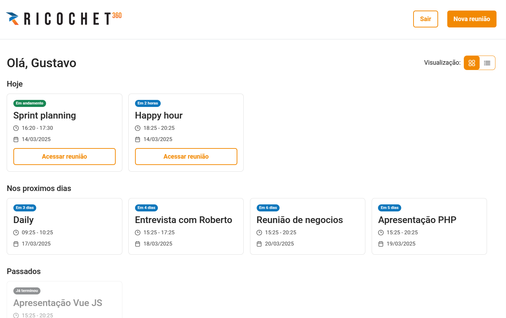
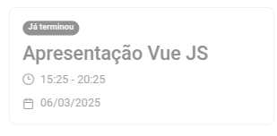

# Desafio Ricochet 360 - Frontend

Este projeto é um desafio da empresa Ricochet 360 de criar um sistema CRM de gestão de reuniões.

## Arquitetura da solução

Este projeto contém as rotas:

- `/login`: Página de login onde os usuários podem inserir suas credenciais para acessar a aplicação;
- `/register`: Página de registro onde novos usuários podem criar uma conta;
- `/dashboard`: Painel onde os usuários autenticados podem ver, agendar, editar e cancelar reuniões;

As rotas de login e registro são abertas. A rota de dashboard é protegida pelo middleware de autenticação, que só permite acesso caso o usuário já tenha iniciado a sessão nesse dispositivo:

## Fluxo de autenticação

Fluxograma que ilustra como o "Auth middleware" e o "User session" funcionam.

## Login e cadastro de usuários

A tela de login possui o campo de email e senha, necessários para fazer o login. Ao enviar o formulário, é exibido um feedback de carregamento em seu botão. Caso ocorra algum erro no login, é exibido um alerta de feedback negativo.

| Login | Login Error |
| --- | --- |
|  |  |

Seu botão se mantém inativo até que seus campos sejam preenchidos corretamente. Para seguir com o cadastro, é necessário ter um e-mail válido e que as duas senhas se correspondam.

| Registro incompleto | Registro completo |
| --- | --- |
|  |  |

## Dashboard de eventos

### Descrição

Nesta tela é possível visualizar todos os eventos do usuário. Eles são divididos entre os eventos de hoje, os que virão no futuro e os já passados.

A tela possui 2 visualizações dos eventos, sendo uma em grid e outra em lista.

### Responsividade

O conteúdo da tela é responsivo, respeitando os breakpoints de tablet e celular.

Observe que na versão mobile, é adicionado um scroll horizontal para melhor visualização dos eventos. Seguindo boas práticas de UX, os eventos possuem o tamanho de 70% da tela para ser possível visualizar o próximo no scroll lateral.

| Tablet | Celular |
| --- | --- |
|  |  |

### Eventos

Cada evento possui título, data de início, horário de início e local. Caso o evento tenha um link, é exibido um botão de acesso à reunião online. No topo do evento, foi colocado um badge que exibe o status do evento, podendo ser "Já terminou", "Em andamento", uma contagem de horas ou uma contagem de dias.

| Evento em andamento | Evento | Evento expirado |
| --- | --- | --- |
|  |  |  |

### Novo evento

Ao clicar no botão do canto superior direito da tela, é aberta uma modal para o cadastro de um novo evento.

Essa modal permite ao usuário criar um novo evento preenchendo título, descrição, início, fim, link e a lista dos participantes.

Ao salvar, o evento é adicionado à lista de eventos do usuário e a modal é fechada. Se o usuário optar por cancelar, a modal é fechada sem salvar as informações.

A lista de participantes é dinâmica de acordo com os usuários cadastrados no banco.

### Notificações

Ao criar um novo evento, é disparada uma notificação para todos os usuários convidados, atualizando duas listas de reunições e disparando um efeito sonoro

https://github.com/user-attachments/assets/748f7cae-32de-4357-8ff7-c502ca6c457c

Para seu funcionamento, foi necessário configurar o plugin `laravel-echo` no projeto. Com ele, foi criado um canal para escutar os eventos do back-end, atualizando a lista de reuniões dos usuários em tempo real.

